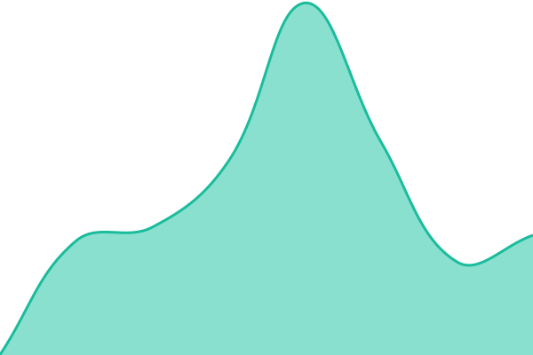
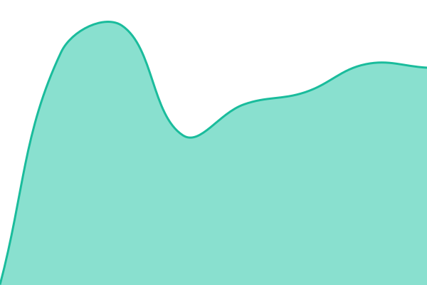

# Salitech Status

Öffentliche Status- und Verfügbarkeitsüberwachung der Salitech-Dienste.

https://status.salitech.de

Das Monitoring basiert auf Upptime und GitHub Actions. Status-, Verfügbarkeits- und Incident-Daten werden automatisch aktualisiert.

Das Monitoring basiert auf [Upptime](https://upptime.js.org) und wird vollständig über GitHub betrieben. GitHub Issues dienen als Incident-Berichte, GitHub Actions als Monitoring und GitHub Pages als Hosting der Statusseite.

<!--start: status pages-->
<!-- This summary is generated by Upptime (https://github.com/upptime/upptime) -->
<!-- Do not edit this manually, your changes will be overwritten -->
<!-- prettier-ignore -->
| URL | Status | History | Response Time | Uptime |
| --- | ------ | ------- | ------------- | ------ |
|  [Salitech Website](https://salitech.de) | 🟩 Up | [salitech-website.yml](https://github.com/HephX/salitech-status/commits/HEAD/history/salitech-website.yml) | 

 656ms
     
 | 

<a href="https://status.salitech.de/history/salitech-website">100.00%</a>
    

|  [Kundenportal](https://app.salitech.de) | 🟩 Up | [kundenportal.yml](https://github.com/HephX/salitech-status/commits/HEAD/history/kundenportal.yml) | 

 348ms
     
 | 

<a href="https://status.salitech.de/history/kundenportal">100.00%</a>
    

|  [Automatisierung](https://automation.salitech.de) | 🟩 Up | [automatisierung.yml](https://github.com/HephX/salitech-status/commits/HEAD/history/automatisierung.yml) | 

 492ms
     
 | 

<a href="https://status.salitech.de/history/automatisierung">100.00%</a>
    

|  [Analytics](https://analytics.salitech.de) | 🟩 Up | [analytics.yml](https://github.com/HephX/salitech-status/commits/HEAD/history/analytics.yml) | 

 498ms
     
 | 

<a href="https://status.salitech.de/history/analytics">100.00%</a>
    

<!--end: status pages-->

[**Visit our status website →**](https://status.salitech.de)

## 📄 License

- Powered by: [Upptime](https://github.com/upptime/upptime)
- Code: [MIT](./LICENSE) © [Anand Chowdhary](https://anandchowdhary.com)
- Data in the `./history` directory: [Open Database License](https://opendatacommons.org/licenses/odbl/1-0/)
